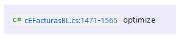
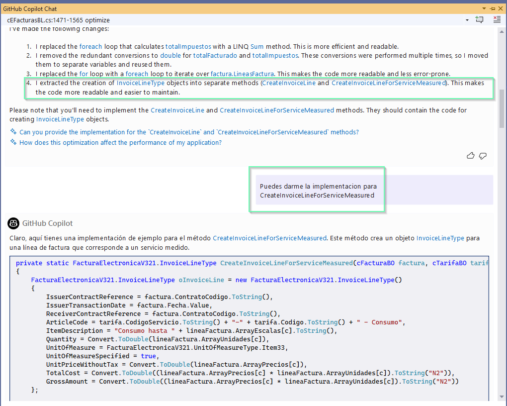
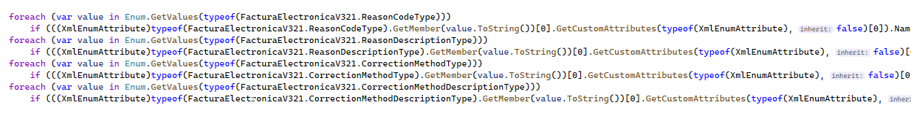
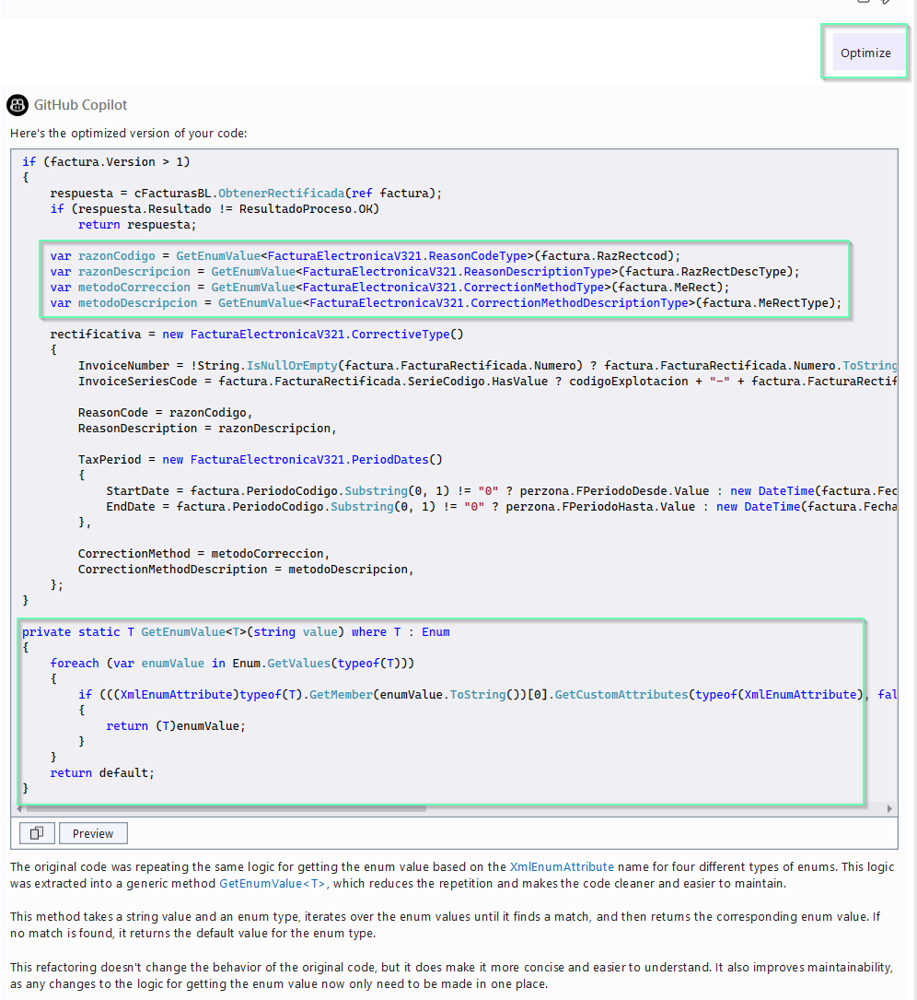
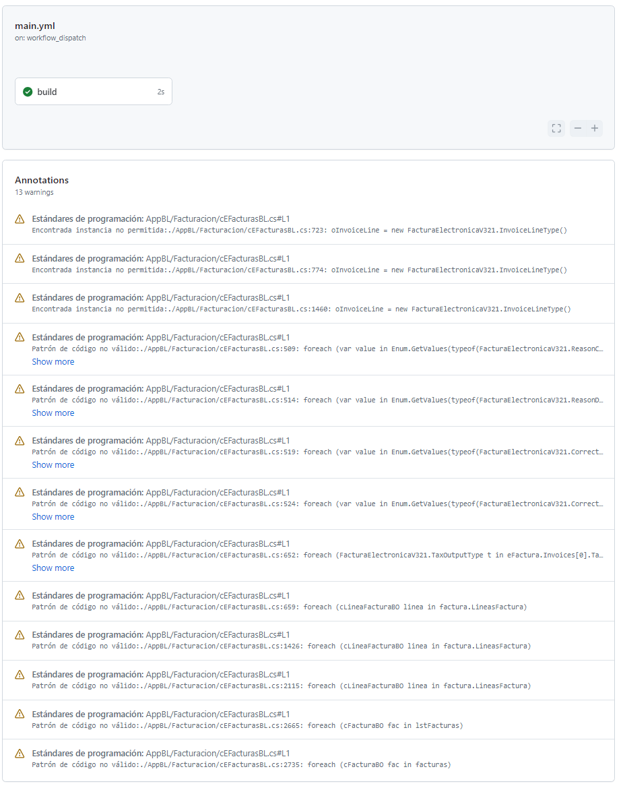
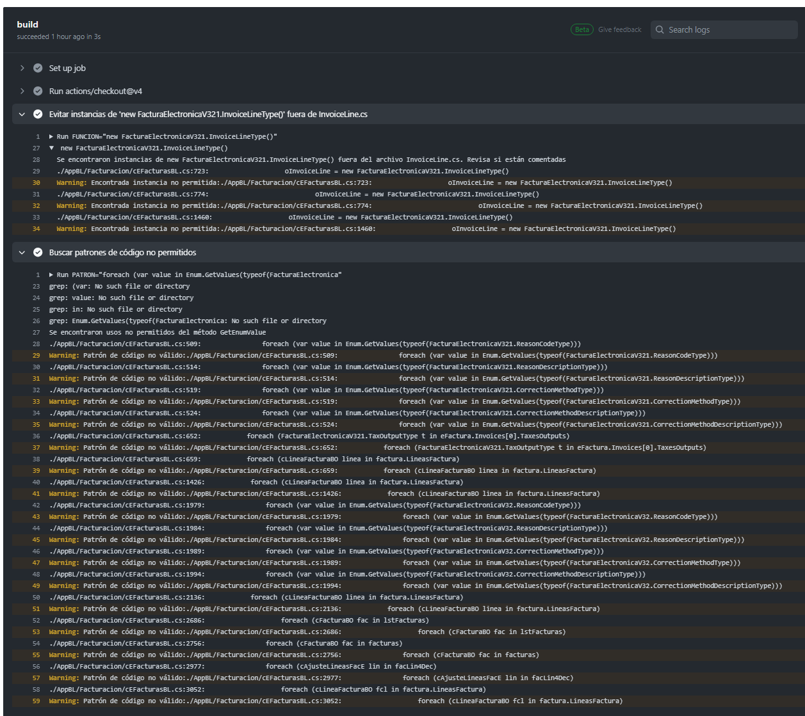

# Optimización de Codigo & Github Actions
> [!CAUTION]
> Este repositorio y las pruebas implementadas se ofrecen como un ejemplo ilustrativo para la creación de **GitHub Actions personalizados** con fines educativos. Su objetivo es demostrar cómo se pueden automatizar revisiones de código específicas para mejorar las prácticas de programación y la calidad del código. 

> [!WARNING] 
> Para prevenir la creación de instancias de clases sin el uso explícito del constructor, *lo ideal sería rediseñar la clase*, fomentando así mejores prácticas de desarrollo.
   


Este repositorio demuestra cómo utilizar GitHub Actions para automatizar la revisión de código, específicamente enfocándonos en la optimización de la clase `cEFacturasBL` y el uso correcto de `InvoiceLine.cs` en el proyecto.

## ¿Qué encontrarás en este repositorio?

- Workflow de GitHub Actions `workflows/main.yml`: Un conjunto de pruebas automatizadas para asegurar la calidad y estándares del código.

- Fichero `InvoiceLine.cs` tiene dos metodos sugeridos por Copilot para refactorizar la clase `cEFacturasBL`

## Sugerencia#1: 



## Sugerencia#2
Resaltando un bloque de codigo como este


Obtenemos la sugerencia de Copilot para refactorizar el codigo


# Github Actions

El workflow se ha configurado para ser lanzado de manera manual.

Si quieres que se ejecute automaticamente solo tienes que intercambiar las lineas comentadas.

```
Ejecución automática
on:  [push, pull_request]

# on: # Ejecución manual
#  workflow_dispatch:
````

### Primer Paso
#### Evitar instancias de 'new FacturaElectronicaV321.InvoiceLineType()' fuera de InvoiceLine.cs

Busca instancias de la creación del objeto fuera del archivo permitido, generando una advertencia por cada caso encontrado.

```
echo "::warning title=Estándares de programación,file=$FILE::Encontrada instancia no permitida:$line"
```

### Segundo Paso
#### Buscar patrones de código no permitidos

Identifica usos no adecuados de ciertas expresiones en el código, como iteraciones sobre enums de una manera no recomendada.

# Resultado




# Conclusión

Este repositorio demuestra el uso de GitHub Actions para la revisión y optimización de código, con ejemplos específicos destinados a ilustrar prácticas de programación mejoradas. 

> [!WARNING]
>Es importante notar que el código proporcionado es parte de un ejemplo ilustrativo y no está destinado para uso en producción tal cual se presenta.

**Invitamos a la Colaboración:** Si tienes sugerencias o mejoras, te animamos a contribuir. Tu participación puede ayudar a enriquecer este recurso para toda la comunidad de desarrolladores.

**Evolución Constante:** La optimización de código y las herramientas de automatización, como GitHub Actions, son campos en constante evolución. Mantente curioso y abierto a nuevas prácticas para seguir creciendo profesionalmente.


